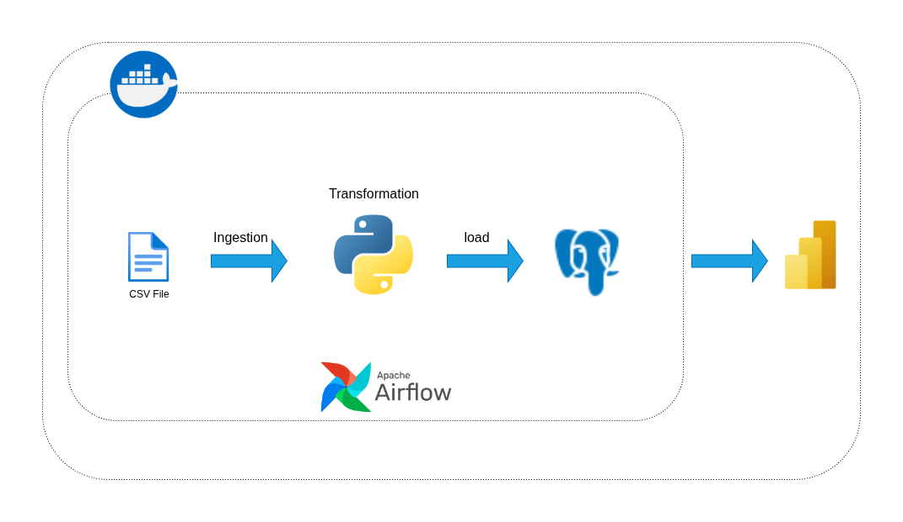

# 🦠 COVID-19 Data Pipeline

A fully containerized, end-to-end **ETL (Extract → Transform → Validate → Load)** data pipeline that ingests daily COVID-19 reports from the Johns Hopkins University CSSE dataset, transforms the raw data into a star-schema dimensional model, validates data quality, and loads it into PostgreSQL — all orchestrated by Apache Airflow.

---

## 📑 Table of Contents

- [Overview](#overview)
- [Architecture](#architecture)
- [Data Model](#data-model)
- [Project Structure](#project-structure)
- [Tech Stack](#tech-stack)
- [Getting Started](#getting-started)
- [Pipeline Stages](#pipeline-stages)
- [Data Validation](#data-validation)
- [Accessing Services](#accessing-services)
- [Environment Variables](#environment-variables)
- [Dependencies](#dependencies)

---

## Overview

This pipeline processes the [JHU CSSE COVID-19 daily reports](https://github.com/CSSEGISandData/COVID-19/tree/master/csse_covid_19_data/csse_covid_19_daily_reports) dataset. Each day the Airflow scheduler triggers the DAG which:

1. **Extracts** the raw CSV directly from GitHub
2. **Transforms** it into three normalized tables (`dim_date`, `dim_location`, `fact_covid_cases`)
3. **Validates** data completeness, schema correctness, referential integrity, and value bounds
4. **Loads** clean data into PostgreSQL

---

## Architecture



> **Pipeline flow (left → right):**  
> **CSV File** *(JHU CSSE daily report)* → **Ingestion** *(pandas via Python)* → **Transformation** *(Python / pandas)* → **Load** *(SQLAlchemy → PostgreSQL)* → **Reporting** *(Power BI)*  
> Everything runs inside **Docker** containers and is orchestrated end-to-end by **Apache Airflow**.

```
┌──────────────────────────────────────────────────────────────────┐
│  🐳 Docker Network                                               │
│                                                                  │
│  CSV File ──► Python ETL ──► PostgreSQL ──► Power BI            │
│  (GitHub)   (Ingest +       (Star Schema)  (Dashboards)         │
│              Transform +                                         │
│              Validate +                                          │
│              Load)                                               │
│                                                                  │
│  ┌─────────────────────────────────────────────────────────┐     │
│  │  Apache Airflow  (schedules & monitors DAG tasks)       │     │
│  │  extract  ──►  transform  ──►  validate  ──►  load      │     │
│  └─────────────────────────────────────────────────────────┘     │
│                                                                  │
│  PostgreSQL (port 5433)   pgAdmin UI (port 5050)                │
│  Airflow UI (port 8080)                                          │
└──────────────────────────────────────────────────────────────────┘
```

---

## Data Model

The pipeline produces a **star schema** optimized for analytical queries:

```
         ┌─────────────┐
         │  dim_date   │
         │─────────────│
         │ date_id  PK │◄──────────────┐
         │ full_date   │               │
         │ year        │               │
         │ month       │      ┌────────┴──────────┐
         │ quarter     │      │  fact_covid_cases  │
         │ month_name  │      │──────────────────  │
         │ day_of_week │      │ fact_id       PK   │
         └─────────────┘      │ date_id       FK   │
                              │ location_id   FK   │
         ┌─────────────┐      │ confirmed          │
         │dim_location │      │ deaths             │
         │─────────────│      │ recovered          │
         │location_id PK│◄────│ active             │
         │country_region│     │ incident_rate      │
         │combined_key │      │ case_fatality      │
         │ lat         │      └────────────────────┘
         │ long_       │
         └─────────────┘
```

| Table | Description |
|---|---|
| `dim_date` | Date dimension with year, month, quarter, day-of-week breakdown |
| `dim_location` | Location dimension with country, region key, and coordinates |
| `fact_covid_cases` | Fact table with confirmed cases, deaths, recovered, active, incident rate, and case-fatality ratio |

---

## Project Structure

```
COVID-19-Data-Pipeline/
│
├── docker-compose.yml          # Orchestrates all services
│
├── docker/
│   ├── Dockerfile              # Python 3.10 ETL image
│   └── init_multiple_db.sh     # Creates covid_pipeline + airflow databases on startup
│
├── pipeline/
│   ├── explore_data.py         # ETL logic: extraction(), transformation(), load()
│   ├── validate_data.py        # Data quality checks (completeness, schema, FK, bounds)
│   ├── liberaries.py           # Shared imports / utilities
│   └── requirements.txt        # Python dependencies
│
├── dags/
│   └── pipeline/               # Airflow mounts this as a Python package
│       └── covid_pipeline_dag.py   # DAG: extract → transform → validate → load
│
├── sql/
│   └── schema.sql              # Star-schema DDL (CREATE TABLE IF NOT EXISTS)
│
├── notebooks/                  # Exploratory analysis notebooks
├── DataFlow.drawio             # Editable architecture diagram
└── DataFlow.drawio.png         # Architecture diagram (rendered)
```

---

## Tech Stack

| Component | Technology |
|---|---|
| Orchestration | Apache Airflow 2.9.3 (LocalExecutor) |
| Database | PostgreSQL 15 (Alpine) |
| DB Admin UI | pgAdmin 4 |
| ETL Language | Python 3.10 |
| Data Processing | pandas 2.3.3 |
| DB Connector | SQLAlchemy 2.0 + psycopg2-binary |
| Containerization | Docker & Docker Compose |

---

## Getting Started

### Prerequisites

- [Docker](https://docs.docker.com/get-docker/) ≥ 24
- [Docker Compose](https://docs.docker.com/compose/) ≥ 2.20
- Internet access (to pull the JHU CSV and Docker images)

### 1 — Clone the repository

```bash
git clone https://github.com/<your-username>/COVID-19-Data-Pipeline.git
cd COVID-19-Data-Pipeline
```

### 2 — Start all services

```bash
docker compose up -d
```

This will:
- Spin up **PostgreSQL** and automatically create the `covid_pipeline` and `airflow` databases
- Apply `sql/schema.sql` (star-schema DDL)
- Run Airflow DB migrations and create the admin user
- Start the **Airflow webserver** and **scheduler**
- Start **pgAdmin**

> First startup takes ~2 minutes while Airflow initializes. Watch progress with:
> ```bash
> docker compose logs -f airflow-init
> ```

### 3 — Trigger the pipeline

Once the webserver is ready, open **http://localhost:8080**, log in, and manually trigger `covid_etl_pipeline` — or wait for the daily schedule.

### 4 — Tear down

```bash
docker compose down          # stop containers, keep volumes
docker compose down -v       # stop containers AND delete all data
```

---

## Pipeline Stages

### Stage 1 — Extract

`extraction()` in `explore_data.py`

Downloads the daily JHU CSSE CSV directly from GitHub using `pandas.read_csv()`. Returns a raw DataFrame with ~4 000 rows (one per region/province).

---

### Stage 2 — Transform

`transformation()` in `explore_data.py`

| Step | Detail |
|---|---|
| Parse dates | `Last_Update` → `datetime` |
| Standardize names | Maps `US → United States`, `Korea, South → South Korea`, etc. |
| Drop unused columns | Removes `FIPS`, `Admin2`, `Province_State` |
| Fix coordinates | Converts negative lat/long to absolute values |
| Fill missing numerics | Fills NaN with column mean |
| Build `dim_date` | Unique normalized dates with year/month/quarter/day-of-week |
| Build `dim_location` | Unique `Combined_Key` locations with coordinates |
| Build `fact_covid_cases` | Joined to dims via FK surrogate keys |

---

### Stage 3 — Validate

`validate()` in `validate_data.py`

Runs **10 categories of checks** across all three tables before a single row reaches the database. A failure raises a `ValueError`, causing the Airflow task to turn red and retry — **the load never runs against bad data**.

See the [Data Validation](#data-validation) section for full details.

---

### Stage 4 — Load

`load()` in `explore_data.py`

Appends the three DataFrames to their PostgreSQL tables using SQLAlchemy (`if_exists='append'`). The `UNIQUE` constraints defined in the schema prevent duplicate rows across runs.

---

## Data Validation

`pipeline/validate_data.py` implements the following checks:

| Check | Tables | Behaviour |
|---|---|---|
| **Not empty** | all | Hard fail if 0 rows |
| **Column presence** | all | Hard fail if expected column is missing |
| **Dtype schema** | all | Hard fail on type mismatch; warn on int↔float |
| **No NULLs** | PK / NOT NULL columns | Hard fail |
| **Uniqueness** | PK columns | Hard fail on duplicates |
| **Composite uniqueness** | `(date_id, location_id)` | Hard fail — mirrors DB UNIQUE constraint |
| **Referential integrity** | FK columns | Hard fail on orphaned FK values |
| **Value bounds** | numeric fact columns | Hard fail if confirmed/deaths/etc. < 0 |
| **Date format** | `dim_date.full_date` | Hard fail if not `YYYY-MM-DD` |
| **Completeness ratio** | all columns | Warning if < 80 % non-null |

All failures are **aggregated** — every problem is collected before a single exception is raised, giving you the full picture at once.

Run validation standalone (outside Docker):

```bash
python pipeline/validate_data.py
```

---

## Accessing Services

| Service | URL | Default Credentials |
|---|---|---|
| Airflow UI | http://localhost:8080 | `ahmed` / *(see compose)* |
| pgAdmin | http://localhost:5050 | `ahmedalaa@gmail.com` / *(see compose)* |
| PostgreSQL | `localhost:5433` | `postgres` / *(see compose)* |

> **pgAdmin — connect to the server:**
> - Host: `postgres` (Docker internal hostname)
> - Port: `5432`
> - Database: `covid_pipeline`
> - Username: `postgres`

---

## Environment Variables

The following variables are injected into Airflow containers via `docker-compose.yml`. Override them to match your environment:

| Variable | Default | Description |
|---|---|---|
| `DB_HOST` | `postgres` | PostgreSQL hostname (Docker service name) |
| `DB_PORT` | `5432` | PostgreSQL port (internal, inside Docker network) |
| `DB_NAME` | `covid_pipeline` | Target database name |
| `DB_USER` | `postgres` | Database user |
| `DB_PASSWORD` | — | Database password |

---

## Dependencies

```
pandas==2.3.3
sqlalchemy==2.0.48
psycopg2-binary==2.9.11
requests==2.32.5
```

Install locally (for development / standalone runs):

```bash
python -m venv .venv
source .venv/bin/activate
pip install -r pipeline/requirements.txt
```

---

## Data Source

**Johns Hopkins University CSSE COVID-19 Dataset**
[github.com/CSSEGISandData/COVID-19](https://github.com/CSSEGISandData/COVID-19)

> The JHU CSSE dataset was discontinued on **March 10, 2023**. The pipeline is designed around the historical daily reports archive and works with any date's CSV by changing the `csv_url` in `explore_data.py`.

---
